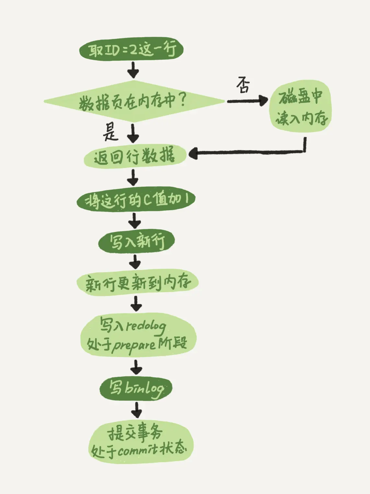

今天整理mysql
# 知识总结
**1. sql语句的执行过程**
- 查询语句
    > 口诀: 连查析优执(连查西游志)
    - mysql可分为Server层和存储引擎层。如下图
        - Server 层包括连接器、查询缓存、分析器、优化器、执行器等，涵盖 MySQL 的大多数核心服务功能，以及所有的内置函数（如日期、时间、数学和加密函数等），所有跨存储引擎的功能都在这一层实现，比如存储过程、触发器、视图等。
        - 存储引擎层负责数据的存储和提取。是插件式的，有innodb, myisam, memory等
    
    - 执行流程
        - 连接器。管理连接的客户端，进行权限验证
        - 查询缓存，之前查询语句和结果以key-value存储在缓存中。
            - 不建议使用。原因是更新语句很容易使查询缓存失效。mysql8.0无查询缓存
        - 分析器
            - 词法分析。识别字符串是什么，代表什么
            - 语法分析。分析语句是否符合mysql语法
        - 优化器
            - 生成执行计划。如何选择索引，join表时决定表的连接顺序
        - 执行器
            - 判断对表是否有查询权限
            - 打开表执行查询

- 更新语句
    - 与查询语句在server层的过程类似。执行过程涉及到日志模块的操作
    - redo log
        - 类似孔乙己掌柜的粉板(redo log)和账本(数据库)。先写redo log，再更新内存。将随机磁盘写变为顺序磁盘写。同时保证了异常重启数据不丢能力。
        - innodb独有。
        - 物理日志，记录某个数据页做了什么修改。避免每次update直接随机访问磁盘数据
    - binlog
        - 逻辑日志。直接追加语句。具有恢复任何时刻数据的能力
        - binlog如何恢复数据库任意时间点的数据
            - 找到该时间点前一次的备份
            - 重放从该备份时间点到该时间点的binlog
    - 更新语句中log的修改如下图。两阶段提交保证了redolog和binlog的一致性。
    

        
**2. 事务隔离级别**

四大隔离级别。默认隔离级别为读提交
- 读未提交。两个事务，一个事务的修改即使未提交也能被另一个事务看到
- 读提交。两个事务，一个事务的修改只有在他提交之后才能被另一个事务看到
- 可重复读。除了读提交之外，两个同时进行的事务，所看到的数据仅限于自己开启事务时的数据和自己所做的修改
- 串行化。两同时进行的事务，哪个事务先加锁，另一个事务加锁就可能被阻塞(读锁和读锁之间不会冲突，其他都会)。

事务隔离级别的实现原理。MVCC

**3. 索引**
- 索引模型
    - 哈希表。适合只有等值查询的场景。nosql
    - 有序数组。适合静态存储引擎，即数据不会修改
    - B+树(数据全在叶子结点)。每个叶子结点是一个page（4KB）。等值查询和区间查询效率都很高
- 主键索引与非主键索引的查询
    - 主键索引叶子结点value就是数据结点，非主键索引叶子结点是value为主键值。非主键索引查询时需要经过回表
- 常见索引名词解释
    - 聚簇与非聚簇索引。聚簇索引的叶子结点是数据结点，聚簇索引的顺序是数据在硬盘上的物理顺序。主键索引一定是聚簇索引
    - 唯一索引(unique key)，是在表上一个或者多个字段组合建立的索引，这个组合在表中不可以重复
    - 主键索引与二级索引。一个标上非主键的索引都是二级索引，叶子结点为主键值
    - 单列索引与联合索引。联合索引是多个字段为索引结点的key， 一般有顺序。联合索引适合索引中多个字段一起查询很频繁的情况
        - 联合索引字段顺序原则。第一原则是，如果通过调整顺序，可以少维护一个索引，那么这个顺序往往就是需要优先考虑采用的。
        - 索引下推。是指在联合索引中决定是否回表时会先进行字段检查
            - 减少了回表查主键索引的次数，从而减少了IO

**4. 锁**

分为全局锁、表锁、行锁。
- 全局锁(FTWRL)。全局锁的使用场景是，做全库逻辑备份

**6. 查询性能优化**

**7. 切分**

**8. 复制**

**9. 存储引擎及其工作原理**

# 面试问题

**10. mysql如何实现事务的ACID性质**

**11. 使用mysql中遇到的问题**
- 长事务导致mysql拖垮
    - 占有锁资源，可能拖垮整个库 
    - 长事务可能导致暂时需要保存很多undo log，会占用内存空间。

**12. 自增主键的使用场景**
自增主键优势
- 二级索引叶子结点是主键值，使用自增主键可以省空间
- 自增主键插入数据，发生结点分裂的频率低，有性能优势

什么情况下使用列作为主键
- 该列是唯一的
- 该列是唯一索引