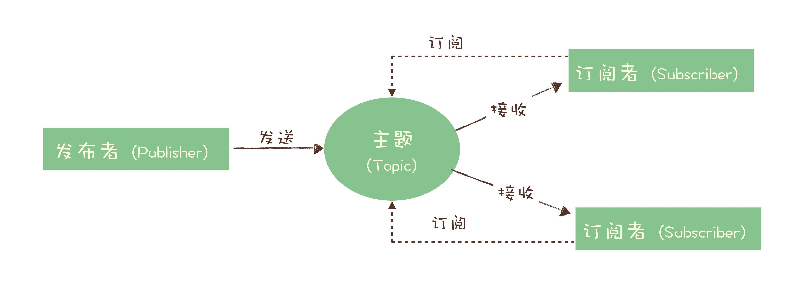

# 消息队列(一)
### **1. 举例说明消息队列的作用**
- 异步处理。更快返回结果，减少等待。
- 流量控制。
- 服务解耦。
- 作为发布 / 订阅系统实现一个微服务级系统间的观察者模式
- 连接流计算任务和数据
- 用于将消息广播给大量接收者。

### **2. 常见消息队列比较**

消息队列需具备的特性
- 消息的可靠传递：确保不丢消息
- Cluster：支持集群，确保不会因为某个节点宕机导致服务不可用，当然也不能丢消息
- 性能：具备足够好的性能，能满足绝大多数场景的性能要求

几种消息队列的优缺点
| **消息队列** | **优点** | **缺点** |
| --- | --- | --- |
| RabbitMQ | 轻量易用 多种协议支持 灵活路由，通过exchange模块实现 健壮、稳定、易用、跨平台、支持多种语言、文档齐全 管理界面丰富社区活跃 | 对消息堆积支持差 性能有瓶颈，几万到十几万 erlang语言二次开发困难 |
| RocketMQ | 性能高，十万级单机吞吐量 分布式高可用 所有消息均持久化，零丢失 支持10亿级别消息堆积，可定制修改源码 | 支持的客户端语言不多 社区活跃度一般 | 
| Kafka | 性能卓越，单机写入TPS约在百万条/秒 分布式高可用 在大数据领域的实时计算以及日志采集被大规模使用 | 由于“攒一波再处理”导致延迟比较高 |

### **3. 消息模型**

消息模型
- 队列模型
    - 同一队列消息的消费是互斥的，如果要多个消费者消费同一条消息，需要创建多个队列，并把这个消息发送到多个队列中
    
- 发布-订阅模型
    - 发布者发送一条消息给主题，可以被多个订阅该主题的消费者消费
    

常见消息队列的消息模型及实现
- RabbitMQ
    - 生产者并不关心将消息发送给哪个队列，而是将消息发送给 Exchange，具体发到哪个队列由Exchange配置
    - 同一份消息如果需要被多个消费者来消费，需要配置 Exchange 将消息发送到多个队列，每个队列中都存放一份完整的消息数据
    

**4. kafka发消息的过程**

**5. 如何保证消息的有序消费**