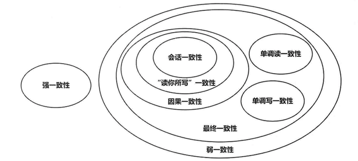

# 分布式系统(一)

一、分布式理论：
1. 什么是CAP理论？

- C是Consistency。client向分布式系统写入一个值之后，读操作必须返回该值。
- A是Availability。只要收到用户的请求，服务器就必须给出回应。
- P是Partition tolerance。大多数分布式系统都分布在多个子网络。每个子网络就叫做一个区（partition）。分区容错的意思是，区间通信可能失败。分布式系统中P不可避免。
CAP定理是指三样不可能同时满足，只能三选二。
- CA (Consistency + Availability)：关注一致性和可用性，它需要非常严格的全体一致的协议，比如“两阶段提交”（2PC）。CA 系统不能容忍网络错误或节点错误，一旦出现这样的问题，整个系统就会拒绝写请求，因为它并不知道对面的那个结点是否挂掉了，还是只是网络问题。唯一安全的做法就是把自己变成只读的。
- CP (consistency + partition tolerance)：关注一致性和分区容忍性。它关注的是系统里大多数人的一致性协议，比如：Paxos 算法 (Quorum 类的算法)。这样的系统只需要保证大多数结点数据一致，而少数的结点会在没有同步到最新版本的数据时变成不可用的状态。这样能够提供一部分的可用性。
- AP (availability + partition tolerance)：这样的系统关心可用性和分区容忍性。因此，这样的系统不能达成一致性，需要给出数据冲突，给出数据冲突就需要维护数据版本。Dynamo 就是这样的系统。

2. 什么是BASE理论？
- 基本可用（Basically Available）。分布式系统在出现不可预知故障的时候，允许损失部分可用性。
- 软状态（Soft State）。软状态也称为弱状态，和硬状态相对，是指允许系统中的数据存在中间状态，并认为该中间状态的存在不会影响系统的整体可用性，即允许系统在不同节点的数据副本之间进行数据听不的过程存在延时。
- 最终一致性（Eventually Consistent）。最终一致性强调的是系统中所有的数据副本，在经过一段时间的同步后，最终能够达到一个一致的状态。因此，最终一致性的本质是需要系统保证最终数据能够达到一致，而不需要实时保证系统数据的强一致性。

3. 什么是2PC?
- 两阶段提交协议。要么所有副本（备份数据）同时修改某个数值，要么都不更改，以此来保证数据的强一致性。

2PC 分为两个过程：
- 表决阶段：此时 Coordinator （协调者）向所有的参与者发送一个 vote request，参与者在收到这请求后，如果准备好了就会向 Coordinator 发送一个 VOTE_COMMIT 消息作为回应，告知 Coordinator 自己已经做好了准备，否则会返回一个 VOTE_ABORT 消息；
- 提交阶段：Coordinator 收到所有参与者的表决信息，如果所有参与者一致认为可以提交事务，那么 Coordinator 就会发送 GLOBAL_COMMIT 消息，否则发送 GLOBAL_ABORT 消息；对于参与者而言，如果收到 GLOBAL_COMMIT 消息，就会提交本地事务，否则就会取消本地事务。
2PC优缺点
- 优点：原理简洁清晰、实现方便；
- 缺点：同步阻塞、单点问题、某些情况可能导致数据不一致。

4. 什么是3PC?
三阶段提交协议（Three-Phase Commit， 3PC）最关键要解决的就是 Coordinator 和参与者同时挂掉导致数据不一致的问题，3PC 把在 2PC 中又添加一个阶段，这样三阶段提交就有：CanCommit、PreCommit 和 DoCommit 三个阶段。

- 阶段一 CanCommit
    - 事务询问：Coordinator 向各参与者发送 CanCommit 的请求，询问是否可以执行事务提交操作，并开始等待各参与者的响应；
    - 参与者向 Coordinator 反馈询问的响应：参与者收到 CanCommit 请求后，正常情况下，如果自身认为可以顺利执行事务，那么会反馈 Yes 响应，并进入预备状态，否则反馈 No。
- 阶段二 PreCommit
    - 执行事务预提交：如果 Coordinator 接收到各参与者反馈都是Yes，那么执行事务预提交：

        - 发送预提交请求：Coordinator 向各参与者发送 preCommit 请求，并进入 prepared 阶段；
        - 事务预提交：参与者接收到 preCommit 请求后，会执行事务操作，并将 Undo 和 Redo 信息记录到事务日记中；
        - 各参与者向 Coordinator 反馈事务执行的响应：如果各参与者都成功执行了事务操作，那么反馈给协调者 ACK 响应，同时等待最终指令，提交 commit 或者终止 abort，结束流程；
    - 中断事务：如果任何一个参与者向 Coordinator 反馈了 No 响应，或者在等待超时后，Coordinator 无法接收到所有参与者的反馈，那么就会中断事务。

        - 发送中断请求：Coordinator 向所有参与者发送 abort 请求；
        - 中断事务：无论是收到来自 Coordinator 的 abort 请求，还是等待超时，参与者都中断事务。
- 阶段三 doCommit
    - 执行提交
        - 发送提交请求：假设 Coordinator 正常工作，接收到了所有参与者的 ack 响应，那么它将从预提交阶段进入提交状态，并向所有参与者发送 doCommit 请求；
        - 事务提交：参与者收到 doCommit 请求后，正式提交事务，并在完成事务提交后释放占用的资源；
        - 反馈事务提交结果：参与者完成事务提交后，向 Coordinator 发送 ACK 信息；
        - 完成事务：Coordinator 接收到所有参与者 ack 信息，完成事务。
    - 中断事务：假设 Coordinator 正常工作，并且有任一参与者反馈 No，或者在等待超时后无法接收所有参与者的反馈，都会中断事务

        - 发送中断请求：Coordinator 向所有参与者节点发送 abort 请求；
        - 事务回滚：参与者接收到 abort 请求后，利用 undo 日志执行事务回滚，并在完成事务回滚后释放占用的资源；
        - 反馈事务回滚结果：参与者在完成事务回滚之后，向 Coordinator 发送 ack 信息；
        - 中断事务：Coordinator 接收到所有参与者反馈的 ack 信息后，中断事务。

