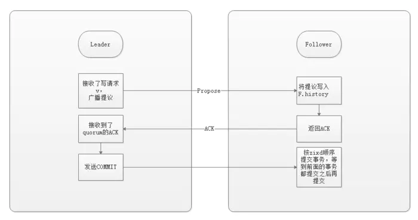
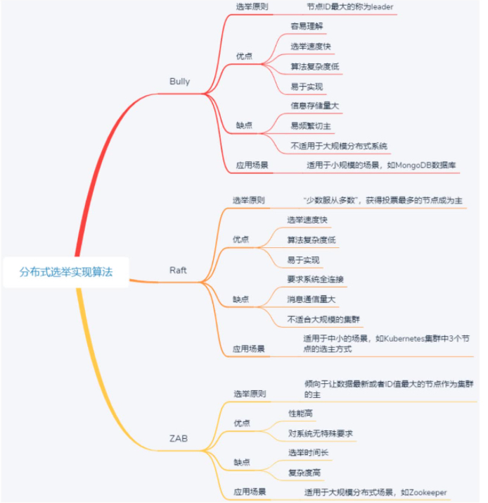

# 分布式系统(二)
5. 什么是ZAB协议？
- [ZAB-一致性算法
](https://houbb.github.io/2018/10/30/zab)
- 特点
    - 主从，只有主服务器能够写入。
    - 数据写入能够保证强一致性。采用类似于2PC的方法来执行写操作(区别在于在第一阶段follower发给ack时，只需要半数以上节点ack主节点就会commit)
    - 节点状态
        - looking。正在选主，不对外提供服务
        - following。从节点
        - leading。主节点
    - zab的四个阶段
        - 选举阶段。为了选出一个准leader。
        
        
        - 发现阶段。发现当前大多数节点接收的最新 Proposal，并且准 Leader 生成新的 epoch，让 Followers 接收，更新它们的 acceptedEpochzab_decovery
        
        - 同步阶段。利用 Leader 前一阶段获得的最新 Proposal 历史，同步集群中所有的副本。只有当 quorum（超过半数的节点） 都同步完成，准 Leader 才会成为真正的 Leader。Follower 只会接收 zxid 比自己 lastZxid 大的 Proposal。
        
        - 广播阶段。Zookeeper 集群才能正式对外提供事务服务，并且 Leader 可以进行消息广播。同时，如果有新的节点加入，还需要对新节点进行同步。需要注意的是，Zab 提交事务并不像 2PC 一样需要全部 Follower 都 Ack，只需要得到 quorum（超过半数的节点）的Ack 就可以。
        

6. 什么是Raft协议？
- 参见[Raft共识算法](https://www.infoq.cn/article/coreos-analyse-etcd/)
- 动图见[raft可视化](http://thesecretlivesofdata.com/raft/#election)

7. 什么是Paxos算法？

8. 分布式选主算法比较

