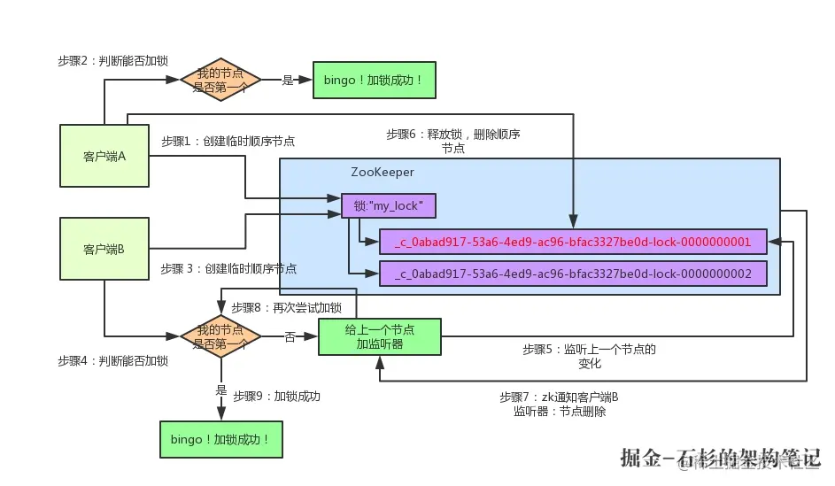

# 分布式系统(三)
二、分布式锁
9. 什么是分布式锁？为何使用分布式锁？
- 锁是实现多线程同时访问统一共享资源，保证同一时刻只有一个线程可访问共享资源所做的一种标记。
- 分布式锁是指分布式环境下，系统部署在多个机器中，实现多进程分布式互斥的一种锁。
- 某些场景需要保证资源只能单个线程修改
    - 电商中大量用户购买扣减库存
    - 自己曾经参与的广告素材审核重构项目中，扣减送审quota

10. 分布式锁的实现

- 有三种主流方法。
    - 基于关系型数据库实现分布式锁。利用关系型数据库的unique key。
        - 加锁。往表中插入一条记录。如果有记录已经存在，则加锁失败
        - 解锁。删除此记录。
        - 存在缺点。单点故障(数据库不可用，整个系统崩溃)。死锁问题(插入记录的进程挂掉，将会产生死锁)。操作数据库很慢，且数据库承担并发有限，**不适合并发高、延时低的场景**
    - 基于缓存实现分布式锁。参考[redis分布式锁](https://redis.io/topics/distlock)
        - redis单机版
            - 加锁。`SET resource_name my_random_value NX PX 30000`
                - my_random_value为一个随机值，在解锁时需要用到。
                - NX，保证在没有`resource_name`key时才能设置(没有锁时才能加锁)。
                - PX，防止客户进程加锁后挂掉造成的死锁问题。
            - 锁释放。lua脚本保证原子性。
                ```
                if redis.call("get",KEYS[1]) == ARGV[1] then
                    return redis.call("del",KEYS[1])
                else
                    return 0
                end
                ```
            - 缺点
                - 由于超时时间导致锁被多 Client 同时获取。如客户进程A执行时间过长，导致锁过期后被客户进程B获取，导致A、B都认为自己获得了锁。
                - 异步的主从复制 & Master 宕机，导致锁丢失。如客户进程A获取锁A之后宕机，且未同步到
        - redis多机版。有有N个Redis主节点，N应该是一个大于2的奇数
            - 加锁。
                - 取得当前时间
                - 使用单节点获取锁的方式，依次获取 N 个节点的 Redis 锁。每个节点获取锁都有timeout, 超过timeout尝试下一个。
                - 如果获取到的锁的数量大于 `N/2+1` 个，且获取的时间小于锁的有效时间(lock validity time)就认为获取到了一个有效的锁，锁自动释放时间就是最初的锁释放时间减去之前获取锁所消耗的时间。
                - 如果获取锁的数量小于 `N/2+1` ，或者在锁的有效时间(lock validity time)内没有获取到足够的锁，就认为获取锁失败，这个时候需要向所有节点发送释放锁的消息。
            - 解锁。
                - 向所有的 Redis 节点发起释放的操作，无论该节点之前是否获取锁成功。
            - 解决锁过期造成的锁共用问题。为所增加一个自增标识。
            
    - 基于zookeeper实现分布式锁
        - 利用使用 ZK 的临时节点和有序节点实现
        
        - 缺陷
            - 羊群效应：当一个节点变化时，会触发大量的 watches 事件，导致集群响应变慢。每个节点尽量少的 watches，这里就只注册 前一个节点 的监听
            - ZK 集群的读写吞吐量不高
            - 网络抖动可能导致 Session 离线，锁被释放