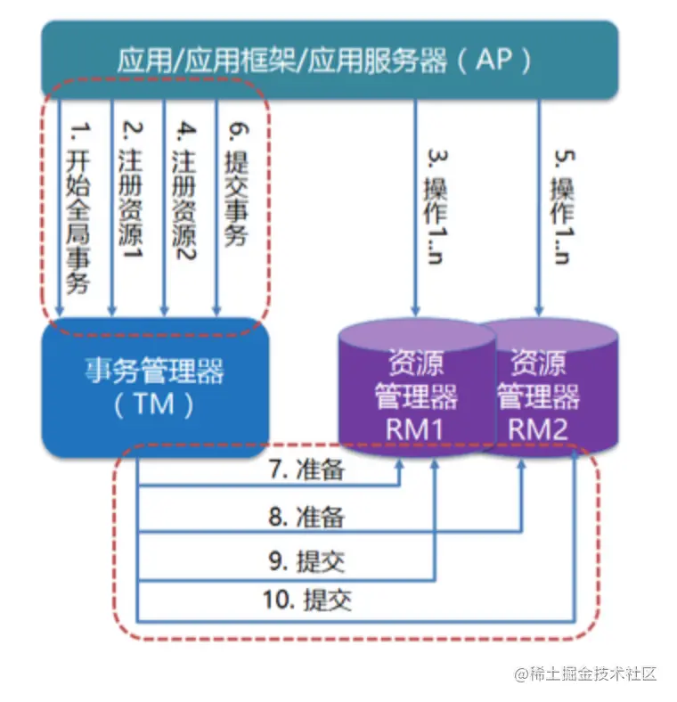
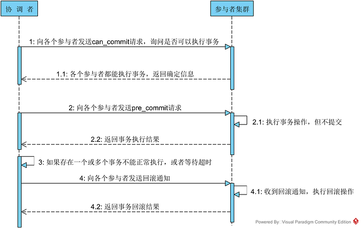
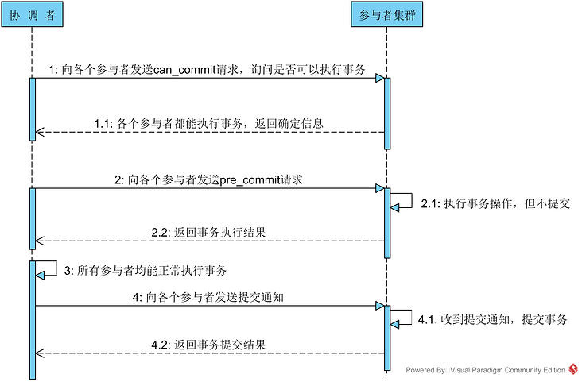
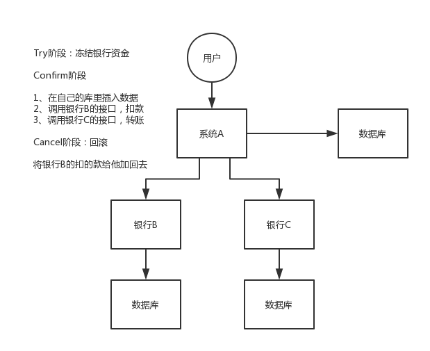

# 分布式系统(四)

三、分布式事务

11. 什么是分布式事务？为什么需要分布式事务
- 事务，其实是包含一系列操作的、一个有边界的工作序列，有明确的开始和结束标志，且要么被完全执行，要么完全失败。通常所说的事务是本地事务。
- 应用场景。
    - 对于网上购物的每一笔订单来说，电商平台一般都会有两个核心步骤：一是订单业务采取下订单操作，二是库存业务采取减库存操作。
    - 通常两个业务会运行在不同机器上，一笔订单，只有这两个操作都完成，才能算做处理成功，否则处理失败。

12. 分布式事务实现

- 三种方法
    - 基于 XA 协议的二阶段提交协议方法；
    
        - 缺点。
            - 同步阻塞。在二阶段提交的过程中直到 commit 结束为止，所有节点都需要等到其它节点完成后才能够释放事务资源
            - 单点问题：协调者（事务管理器）如果一旦出现故障那么整个服务就会不可用。
            - 数据不一致。如果说所有资源管理器都反馈的准备好了，这时候进入 commit 阶段，但是由于网络问题或者说某个资源管理器挂了，那么就会存在一部分机器执行了事务，另外一部分没有执行导致数据不一致
    - 三阶段提交协议方法；
    
        - CanCommit。can_commmit有失败
            
        - PreCommit。pre_commit有失败
            
        - DoCommit。全部成功
            
    - 基于消息的最终一致性方法。
        > 可参考[可靠消息最终一致性解决方案](https://juejin.cn/post/6844904143685959693)
        
    
        - 生产者发送消息给消息确认服务器,消息确认服务器存储消息，并且把消息状态改为待确认。
        - 生产者发送消息后执行本地数据库，执行成功则确认消息，失败则删除消息。
        - 此时如果是确认消息，那么消息确认服务器就把数据库里的消息状态更新为“已发送”，同时将消息发送给MQ。5.1,5.2在一个事务中，要么都成功，要么都失败
        - 消费者一直等着从MQ消费消息，如果消费到了消息，那么就操作自己本地数据库
        - 如果操作成功了，就反过来通知消息确认服务器，说自己处理成功了，然后消息确认服务器就会把消息的状态设置为“已完成”。
        - 消息确认服务后台不断轮询自身数据库消息状态。如果待确认消息超时，则回调生产者提供的一个接口，确认生产者数据库操作状态，若上游执行成功，消息改为发送同时投递MQ，若上游执行失败，删除自身数据库消息。如果已提交消息超时，说明下游消费者消费发生问题，尝试重新投递MQ，让消费者再次执行，需要保证消费者消费的幂等性。
    - TCC强一致性方案。
        
        - 流程
            - Try 阶段：这个阶段说的是对各个服务的资源做检测以及对资源进行 锁定或者预留。
            - Confirm 阶段：这个阶段说的是在各个服务中执行实际的操作。
            - Cancel 阶段：如果任何一个服务的业务方法执行出错，那么这里就需要 进行补偿，就是执行已经执行成功的业务逻辑的回滚操作。（把那些执行成功的回滚）
        - 缺点
            - 事务回滚实际上是严重依赖于开发则写代码来回滚和补偿，会造成补偿代码巨大
        
