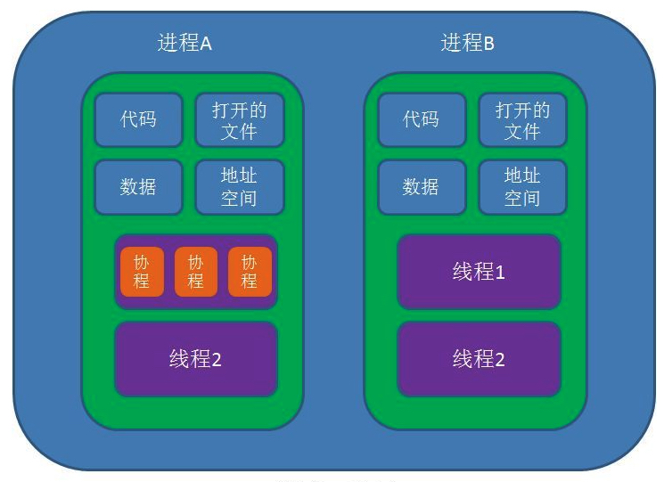

# 操作系统(一)

**进程、线程与协程的区别**
> 参考[什么是协程，协程和线程的区别和联系？](https://segmentfault.com/a/1190000040373756)
- 线程本质就是堆栈，当一段程序在执行，能代表它的是他的过去和现在。过去 在堆栈中，现在 则是 CPU 的所有寄存器，如果我们要挂起一个线程，我们把寄存器也保存到堆栈中，我们就具有它的所有状态，可以随时恢复它。是独立调度的基本单位。

- 进程的本质是地址空间，当我们切换线程的时候，同时切换它的地址空间（通过修改MMU即可），则认为发生了进程切换。是资源分配的基本单位

- 协程本质上就是用户态下的线程，协程切换没有内核态用户态切换，因此开销小。

- 进程与线程的区别
> [进程与线程的一个简单解释](https://www.ruanyifeng.com/blog/2013/04/processes_and_threads.html)
    - 资源上，进程是资源分配的基本单位，但是线程不拥有资源，线程可以访问隶属进程的资源。
    - 调度上，线程是独立调度的基本单位，在同一进程中线程切换的话不会引起进程的切换，从一个进程中的线程切换到另一个进程中的线程时，会引起进程的切换。
    - 系统开销上，由于创建或撤销进程，系统都要分配回收资源，所付出的开销远大于创建或撤销线程时的开销。类似的，在进行进程切换的时候，涉及当前执行进程 CPU 环境的保存及新调度进程 CPU 环境设置，而线程切换只需保存和设置少量寄存器的内容，开销很小。
    - 通信上，线程间可以通过直接读写同一进程的数据进行通信，但是进程通信需要借助一些复杂的方法。
- 有了线程，为何还要协程？
    - 一是节省 CPU，避免系统内核级的线程频繁切换，造成的 CPU 资源浪费。好钢用在刀刃上。而协程是用户态的线程，用户可以自行控制协程的创建于销毁，极大程度避免了系统级线程上下文切换造成的资源浪费。
    - 二是节约内存，在 64 位的 Linux 中，一个线程需要分配 8MB 栈内存和 64MB 堆内存，系统内存的制约导致我们无法开启更多线程实现高并发。而在协程编程模式下，可以轻松有十几万协程，这是线程无法比拟的。
    - 三是稳定性，前面提到线程之间通过内存来共享数据，这也导致了一个问题，任何一个线程出错时，进程中的所有线程都会跟着一起崩溃。
    - 四是开发效率，使用协程在开发程序之中，可以很方便的将一些耗时的 IO 操作异步化，例如写文件、耗时 IO 请求等。

**并发与并行区别， 阻塞与非阻塞却别，同步与异步区别**
- 并发与并行
    - 并发就是在一段时间内，多个任务都会被处理；但在某一时刻，只有一个任务在执行。单核处理器可以做到并发。
    - 并行就是在同一时刻，有多个任务在执行。这个需要多核处理器才能完成，在微观上就能同时执行多条指令，不同的程序被放到不同的处理器上运行，这个是物理上的多个进程同时进行。

- 阻塞与非阻塞
    - 阻塞与非阻塞是对同一个线程来说的，在某个时刻，线程要么处于阻塞，要么处于非阻塞。阻塞和非阻塞关注的是程序在等待调用结果（消息，返回值）时的状态：阻塞调用是指调用结果返回之前，当前线程会被挂起。调用线程只有在得到结果之后才会返回。非阻塞调用指在不能立刻得到结果之前，该调用不会阻塞当前线程。

- 同步与异步
    - 同步与异步是对应于调用者与被调用者，它们是线程之间的关系，两个线程之间要么是同步的，要么是异步的。同步操作时，调用者需要等待被调用者返回结果，才会进行下一步操作。而异步则相反，调用者不需要等待被调用者返回调用，即可进行下一步操作，被调用者通常依靠事件、回调等机制来通知调用者结果

**系统调用 / 用户态和内核态**
- 什么是系统调用？
    - 系统调用(System call)是程序向系统内核请求服务的方式。可以包括硬件相关的服务(例如，访问硬盘等)，或者创建新进程，调度其他进程等。系统调用是程序和操作系统之间的重要接口。
- 为什么要有系统调用？
    - 用户程序随意直接访问修改数据和系统关键信息是非常危险的，访问网卡、磁盘中的数据须由内核的例程访问比较安全。通过内核的例程操作计算机的关键数据就是系统调用。
- 用户态和内核态？
    - 内核态：处于内核态的 CPU 可以访问任意的数据，包括外围设备，比如网卡、硬盘等，处于内核态的 CPU 可以从一个程序切换到另外一个程序，并且占用 CPU 不会发生抢占情况，一般处于特权级 0 的状态我们称之为内核态。
    - 用户态：处于用户态的 CPU 只能受限的访问内存，并且不允许访问外围设备，用户态下的 CPU 不允许独占，也就是说 CPU 能够被其他程序获取。

**有哪些系统调用**
- 使用软件中断（Software interrupt）触发系统调用；
- 使用 SYSCALL / SYSENTER 等汇编指令触发系统调用；
- 使用虚拟动态共享对象（virtual dynamic shared object、vDSO）执行系统调用；

**如何从用户态切换到内核态**
- 应用程序 在 用户态 准备好调用参数，执行 int 指令触发 软中断 ，中断号为 0x80 ；
- CPU 被软中断打断后，执行对应的 中断处理函数 ，这时便已进入 内核态 ；
- 系统调用处理函数 准备 内核执行栈 ，并保存所有 寄存器 (一般用汇编语言实现)；
- 系统调用处理函数 根据 系统调用号 调用对应的 C 函数—— 系统调用服务例程 ；
- 系统调用处理函数 准备 返回值 并从 内核栈 中恢复 寄存器 ；
- 系统调用处理函数 执行 ret 指令切换回 用户态 ；

**从用户态切换到内核态为何开销大**
应用程序通过软件中断陷入内核态并在内核态查询并执行系统调用表注册的函数，整个过程不仅需要存储寄存器中的数据、从用户态切换至内核态，还需要完成验证参数的合法性，与函数调用的过程相比确实会带来很多的额外开销10。

