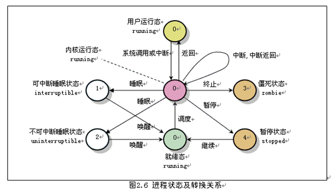
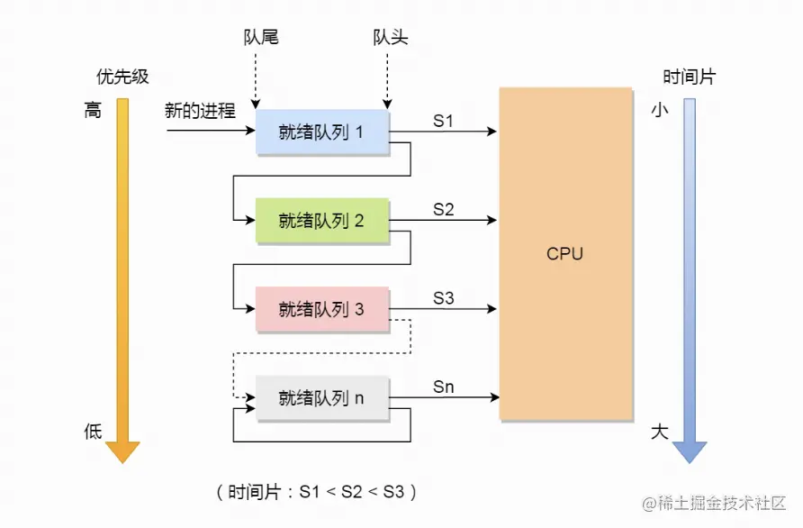

# 操作系统(二)
**进程在创建和撤销时发生了什么**

**进程的生命周期**
进程一共有5种状态，分别是创建、就绪、运行（执行）、终止、阻塞。

- 运行态→阻塞态：往往是由于等待外设，等待主存等资源分配或等待人工干预而引起的。
- 阻塞态→就绪态：则是等待的条件已满足，只需分配到处理器后就能运行。
- 运行态→就绪态：不是由于自身原因，而是由外界原因使运行状态的进程让出处理器，这时候就变成就绪态。例如时间片用完，或有更高优先级的进程来抢占处理器等。
- 就绪态→运行态：系统按某种策略选中就绪队列中的一个进程占用处理器，此时就变成了运行态。

linux状态模型
- 运行状态（TASK_RUNNING）：是运行态和就绪态的合并，表示进程正在运行或准备运行，Linux 中使用TASK_RUNNING 宏表示此状态
- 可中断睡眠状态（浅度睡眠）（TASK_INTERRUPTIBLE）：进程正在睡眠（被阻塞），等待资源到来是唤醒，也可以通过其他进程信号或时钟中断唤醒，进入运行队列。Linux 使用TASK_INTERRUPTIBLE 宏表示此状态。
- 不可中断睡眠状态（深度睡眠状态）（TASK_UNINTERRUPTIBLE）：其和浅度睡眠基本类似，但有一点就是不可被其他进程信号或时钟中断唤醒。Linux 使用TASK_UNINTERRUPTIBLE 宏表示此状态。
- 暂停状态（TASK_STOPPED）：进程暂停执行接受某种处理。如正在接受调试的进程处于这种状态，Linux 使用TASK_STOPPED 宏表示此状态。
- 僵死状态（TASK_ZOMBIE）：进程已经结束但未释放PCB，Linux 使用TASK_ZOMBIE 宏表示此状

**进程控制块(PCB)是什么**
进程控制块包括：
进程描述信息：
- 进程标识符用于唯一的标识一个进程（pid，ppid）。
进程控制信息：
- 进程当前状态
- 进程优先级
- 程序开始地址
- 各种计时信息
- 通信信息
资源信息：
- 占用内存大小及管理用数据结构指针
- 交换区相关信息
- I/O设备号、缓冲、设备相关的数结构
- 文件系统相关指针
现场保护信息（cpu进行进程切换时）：
- 寄存器
- PC
- 程序状态字PSW
- 栈指针

**进程调度策略**
- 先来先服务(FCFS)：非抢占式的调度算法，按照请求的顺序进行调度。有利于长作业，但不利于短作业，因为短作业必须一直等待前面的长作业执行完毕才能执行，而长作业又需要执行很长时间，造成了短作业等待时间过长。另外，对I/O密集型进程也不利，因为这种进程每次进行I/O操作之后又得重新排队。
- 短作业优先(SJF)：非抢占式的调度算法，按估计运行时间最短的顺序进行调度。长作业有可能会饿死，处于一直等待短作业执行完毕的状态。因为如果一直有短作业到来，那么长作业永远得不到调度。
- 最短剩余时间优先：最短作业优先的抢占式版本，按剩余运行时间的顺序进行调度。 当一个新的作业到达时，其整个运行时间与当前进程的剩余时间作比较。如果新的进程需要的时间更少，则挂起当前进程，运行新的进程。否则新的进程等待。
- 时间片轮转(Round Robin)：将所有就绪进程按 FCFS 的原则排成一个队列，每次调度时，把 CPU 时间分配给队首进程，该进程可以执行一个时间片。当时间片用完时，由计时器发出时钟中断，调度程序便停止该进程的执行，并将它送往就绪队列的末尾，同时继续把 CPU 时间分配给队首的进程。时间片轮转算法的效率和时间片的大小有很大关系：因为进程切换都要保存进程的信息并且载入新进程的信息，如果时间片太小，会导致进程切换得太频繁，在进程切换上就会花过多时间。 而如果时间片过长，那么实时性就不能得到保证。
- 优先级调度：为每个进程分配一个优先级，按优先级进行调度。为了防止低优先级的进程永远等不到调度，可以随着时间的推移增加等待进程的优先级。
- 多级反馈队列调度算法。
    - 有多个队列，每个队列优先级不同，队列优先级越高，时间片越短。
    - 新来的进程会先进入最高优先级队列，如果在一级队列的时间片内没有执行完，该进程会被向下送入二级队列，以此类推，直至进程执行完成。
    - 只有高级队列为空时，才执行低级队列中的进程。假如正在执行低级队列中的进程，此时高级队列中来了新进程，则停止运行当前进程，转而运行高级队列中的进程。
    

**进程间同步方式**
1. 临界区：通过对多线程的串行化来访问公共资源或一段代码，速度快，适合控制数据访问。
    - 优点：保证在某一时刻只有一个线程能访问数据的简便办法。
    - 缺点：虽然临界区同步速度很快，但却只能用来同步本进程内的线程，而不可用来同步多个进程中的线程。

2. 互斥量：为协调共同对一个共享资源的单独访问而设计的。互斥量跟临界区很相似，比临界区复杂，互斥对象只有一个，只有拥有互斥对象的线程才具有访问资源的权限。
    - 优点：使用互斥不仅仅能够在同一应用程序不同线程中实现资源的安全共享，而且可以在不同应用程序的线程之间实现对资源的安全共享。
    - 缺点：通过互斥量可以指定资源被独占的方式使用，但无法使指定数量的线程共用资源。

3. 信号量：为控制一个具有有限数量用户资源而设计。它允许多个线程在同一时刻访问同一资源，但是需要限制在同一时刻访问此资源的最大线程数目。互斥量是信号量的一种特殊情况，当信号量的最大资源数=1就是互斥量了。

4. 事件： 用来通知线程有一些事件已发生，从而启动后继任务的开始。

**进程间通信方式**
> [进程间通信的方式——信号、管道、消息队列、共享内存](https://www.cnblogs.com/luo77/p/5816326.html)
- 管道pipe：管道是一种半双工的通信方式，数据只能单向流动，而且只能在具有亲缘关系的进程间使用。进程的亲缘关系通常是指父子进程关系。
- 命名管道FIFO：有名管道也是半双工的通信方式，但是它允许无亲缘关系进程间的通信。
- 消息队列MessageQueue：消息队列是由消息的链表，存放在内核中并由消息队列标识符标识。消息队列克服了信号传递信息少、管道只能承载无格式字节流以及缓冲区大小受限等缺点。
- 共享存储SharedMemory：共享内存就是映射一段能被其他进程所访问的内存，这段共享内存由一个进程创建，但多个进程都可以访问。共享内存是最快的 IPC 方式，它是针对其他进程间通信方式运行效率低而专门设计的。它往往与其他通信机制，如信号两，配合使用，来实现进程间的同步和通信。
- 信号量Semaphore：信号量是一个计数器，可以用来控制多个进程对共享资源的访问。它常作为一种锁机制，防止某进程正在访问共享资源时，其他进程也访问该资源。因此，主要作为进程间以及同一进程内不同线程之间的同步手段。
- 套接字Socket：套解口也是一种进程间通信机制，与其他通信机制不同的是，它可用于不同及其间的进程通信。
- 信号 ( sinal ) ： 信号是一种比较复杂的通信方式，用于通知接收进程某个事件已经发生。

