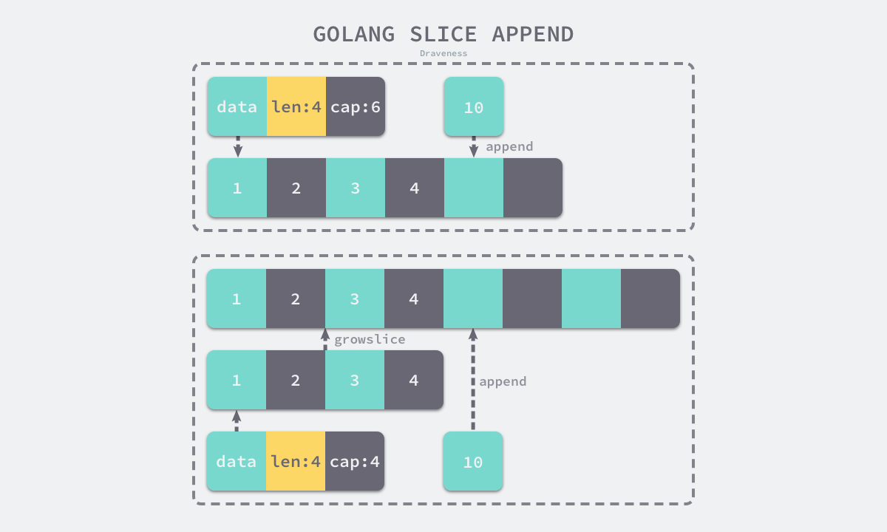

# Go总结
## Go
**1. slice, map，slice是怎么实现的。**
> 参考[go语言设计与实现](https://draveness.me/golang/docs/)
- go传参时永远是值传递
- array实现
    - array数据结构
    ```go
    type Array struct {
        Elem  *Type // element type
        Bound int64 // number of elements; <0 if unknown yet
    }
    ```
- slice
    - 三种初始化方式
        - 下标
            ```go
            arr := [3]int{1, 2, 3}
            slice := arr[0:1]
            ```
        - 字面量
            ```
            slice := []int{1, 2, 3}
            ```
        - 
    - slice的数据结构
    ```go
    type slice struct {
        array unsafe.Pointer
        len   int
        cap   int
    }
    ```
    - slice的扩容。
        - 如果期望容量大于当前容量的两倍就会使用期望容量；
        - 如果当前切片的长度小于 1024 就会将容量翻倍；
        - 如果当前切片的长度大于 1024 就会每次增加 25% 的容量，直到新容量大于期望容量；
    - slice append元素
        - 切片容量不足时需扩容，否则直接赋值即可
        
- 哈希表
    - 核心数据结构为hmap和bmap
    
    - 访问操作如何寻址
    
    - 写入
        - for循环遍历正常桶和溢出桶，如存在key，则g更新val。不存在，则通过移动内训，插入新key和新val
    - 扩容
        - 当装载因子超过6.5或者哈希使用了太多溢出桶，就会发生扩容。
        - 等量扩容(sameSizeGrow)和增量扩容。sameSizeGrow 是一种特殊情况下发生的扩容，当我们持续向哈希中插入数据并将它们全部删除时，如果哈希表中的数据量没有超过阈值，就会不断积累溢出桶造成缓慢的内存泄漏。
        - 扩容过程
            - 创建2倍大小的新buckets数组，当前buckets指针赋给oldbuckets
            - 在写入过程中，旧桶元素会分流到新桶中(1旧桶->2新桶)，若写入元素不存在，该写入元素会写入新桶
            - 扩容过程中，访问元素，若元素没有分流，仍访问旧桶
        - 删除操作
            - 删除若碰上分流，先完成分流，然后在新桶中完成键值对的删除

- 字符串
    - 数据结构
        ```go
        type StringHeader struct {
            Data uintptr
            Len  int
        }
        ```
    

2. map和slice并发访问的安全性问题


**3. go里面的几种锁和原子变量怎么用，怎么实现的。**


**4. channel**

**5. 协程**

**6. GMP调度模型要讲清楚原理。**

**7. 锁**

**8. golang GC**
- GC的意义
    - 解决因忘记清理不使用的内存区域造成的内存泄漏，避免业务无关的内存申请释放造成的开发负担
    - C/C++存由程序员管理， Java/Python/Go等语言均有垃圾回收机制
    - 无GC的语言一般采用内存泄漏检测工具来辅助检测。C++使用智能指针来解决程序员管理内存的问题
- GC常用算法
    - 引用计数
        - 对每个对象维护一个引用计数。当引用计数减为0时，
    - 标记清除

    - 复制整理
    - 分代回收

- Golang GC

9. epoll原理
10. Golang 反射

